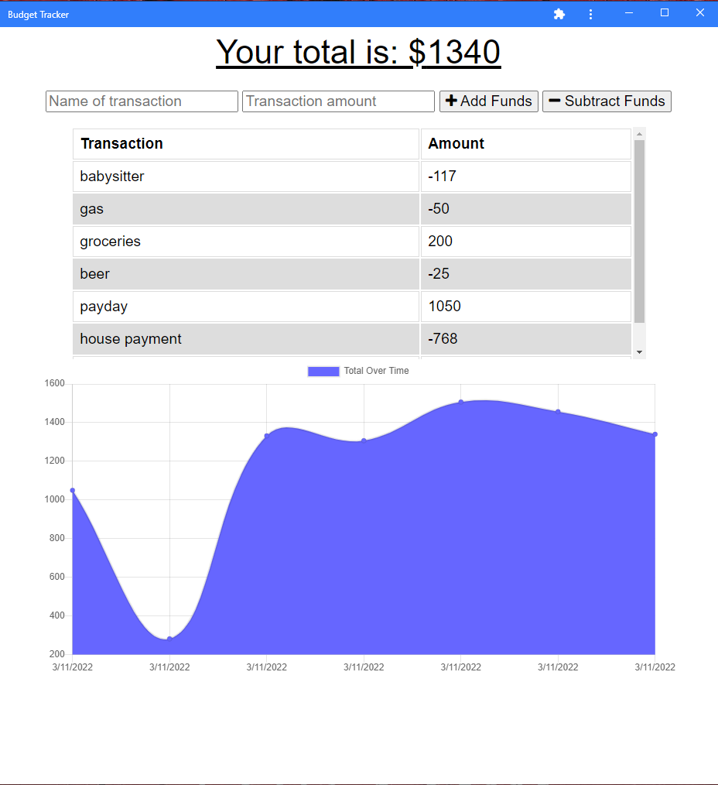

 </a>

<h3 align="center">Budget Tracker</h3>

---

## 

- [About](#about)
- [Installing](#installing)
- [Usage](#usage)
- [Built With](#built_using)
- [Authors](#authors)
- [Questions](#questions)
- [Screenshots](#screenshots)

## 

- Budget Tracker gives users a fast and easy way to track their money. It works both online or offline so you always know how much money you don't have. You may also install Budget Tracker on your desktop or smartphone for quick and easy access.

## 

1. Clone repository
2. Run `npm install`
3. Run `npm start`
4. Navigate to localhost:3001

## 

- To use Budget Tracker simply input your transaction name, amount, and whether it is adding funds or subtracting funds.
Installing on your desktop or smartphone is a breeze. For desktop click the install icon in the address bar and done. For smartphones tap on the share icon and add to your homescreen. 

## 

- Node.js
- Express.js
- HTML
- CSS
- Javascript

## 

- [glenluersman](https://github.com/glenluersman)

## 

- Feel free to open an issue or contact me directly at glen.luersman@gmail.com if you have any questions about the repo. You can find more of my work at [glenluersman](https://github.com/glenluersman/).

## 

- Deployed at Heroku: https://mysterious-reef-48892.herokuapp.com/

</a>
